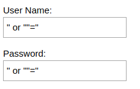

<p align="center">
    
</p>

<h3 align="center">Universidade Federal do Ceará</h3>

<p align="center">Repositório dedicado para a elaboração de um laboratório sobre Injeção SQL para disciplina de Segurança da Informação.</p> 

---

## Sumário

- [Leia-me](#leia-me)
- [Objetivos](#objetivos)
- [Linguagem de Consulta Estruturada](#linguagem-de-consulta-estruturada)
- [Injeção SQL](#injeção-sql)
- [Ferramentas](#ferramentas)
- [Configuração de Ambiente](#configuração-de-ambiente)
- [Prática](#prática)

## Leia-me

Como previsto na **Lei 12.737/2012 no Art. 154-A**.  Invadir dispositivo informático alheio, conectado ou não à rede de computadores, mediante violação indevida de mecanismo de segurança e com o fim de obter, adulterar ou destruir dados ou informações sem autorização expressa ou tácita do titular do dispositivo ou instalar vulnerabilidades para obter vantagem ilícita, resultará em **Pena – detenção, de 3 (três) meses a 1 (um) ano, e multa**.

Lei Nº 12.737, de 30 de novembro de 2012.

## Objetivos
- Aprender sobre injeção SQL.
- Obter noção básica sobre o uso da ferramenta SQLmap.
- Apresentar processos de detecção e exploração de falhas de injeção SQL.

## Linguagem de Consulta Estruturada

Linguagem de Consulta Estruturada ou SQL, é uma linguagem de pesquisa declarativa padrão de gerenciamento de dados que interage com os principais bancos de dados baseados no modelo relacional.

Os comandos SQL são agrupados em quatro categorias. Estes comandos são os principais usados no gerenciamento, manutenção e consulta de um banco de dados relacional.
. 

- **DDL** - Linguagem de Definição de Dados.
    - *CREATE* - criar banco de dados, tabelas, colunas.
    - *DROP* - remover um objeto no banco de dados.
    - *ALTER* - altera a estrutura da base de dados.
    - *TRUNCATE* - remover todos os registros de uma tabela. Limpa a tabela por completo. Semelhante ao parâmetro Purge de remoção de programas no Linux.
    - *COMMENT* - adicionar comentários ao dicionário de dados.
    - *RENAME* - para renomear um objeto.
- **DML** - Linguagem de Manipulação de Dados.
    - *INSERT* - inserir dados em uma tabela.
    - *SELECT* - recuperar dados do banco de dados.
    - *UPDATE* - atualiza os dados existentes em uma tabela.
    - *DELETE* - exclui registros de uma tabela.
    - *CALL* - chamar um subprograma PL / SQL.
    - *EXPLAIN PLAN* - explicar o caminho de acesso aos dados.
    - *LOCK TABLE* - controle de concorrência.
- **DCL** - Linguagem de Controle de Dados
    - *GRANT* - atribui privilégios de acesso do usuário a objetos do banco de dados.
    - *REVOKE* - remove os privilégios de acesso aos objetos obtidos com o comando *GRANT*.
- **DTL** ou **TCL** - Linguagem de Transação de Dados
    - *COMMIT* - salvar o trabalho feito.
    - *SAVEPOINT* - identificar um ponto em uma transação para que mais tarde você pode efetuar um *ROLLBACK*.
    - *ROLLBACK* - restaurar banco de dados ao original desde o último *COMMIT*.


**Exemplos**:

DDL
```sql
CREATE TABLE Users (
    id INTEGER PRIMARY KEY NOT NULL AUTO_INCREMENT,
    Name VARCHAR(50) NOT NULL,
    Pass VARCHAR(75) NOT NULL
);
```

DML
```sql
INSERT INTO Users (Name, Pass) VALUES ('Leo Jaimesson', '@#$%&*uF(2015.1')
```

DCL
```sql
GRANT ALL ON *.* TO 'leojaimesson'@'localhost';
```

DTL
```sql
SAVEPOINT savepoint_name;
```

## Injeção SQL

**Injeção SQL trata-se de uma técnica para realizar ataques por meio de manipulação de código SQL**. O ataque ocorre quando o atacante consegue inserir uma série de instruções SQL dentro de uma consulta (*query*) através da manipulação das entradas de dados de uma aplicação.

Uma exploração de injeção de SQL bem-sucedida pode:
- Ler e modificar dados confidenciais do banco de dados.
- Executar operações de administração no banco de dados.
    - Auditoria de desligamento ou o [DBMS](http://knoow.net/ciencinformtelec/informatica/database-management-systems-dbms/).
    - Truncar tabelas e logs.
    - Adicionar usuários.
- Recuperar o conteúdo de um determinado arquivo presente no sistema de arquivos do DBMS.
- Emitir comandos para o sistema operacional.

**Exemplo**:

O atacante injeta os comandos sql no sistema alvo.



O resultado será que a consulta irá ficar da seguinte maneira.

```sql
SELECT * FROM Users WHERE Name ="" or ""="" AND Pass ="" or ""="";
```


## Ferramentas

**Ferramentas que serão utilizadas**:

[Vulnweb](http://testphp.vulnweb.com/) é uma aplicação web deliberadamente inseguro disponibilizado pela *Acunetix* que permite que desenvolvedores e estudantes interessados testem vulnerabilidades normalmente encontradas em aplicações baseados na linguagem de programação PHP que usam componentes de código comuns e populares. 

[SQLmap](http://sqlmap.org) é uma ferramenta de teste de penetração de software livre. Essa ferramenta permite automatizar o processo de detecção e exploração de falhas de injeção SQL. Ele vem com um poderoso mecanismo de detecção, diversos recursos para o testador de penetração e uma ampla variedade de opções como impressão digital do banco de dados, busca de dados do banco de dados, acesso ao sistema de arquivos subjacente e a execução de comandos no sistema operacional.


## Configuração de Ambiente

Neste laboratório será necessário a ferramenta *SQLmap* na versão 1.2.

Para baixar a ferramenta basta executar um dos seguintes comandos no seu terminal. Você pode instalar através da linha de comando com curl ou wget.

**via curl**
```console
curl https://codeload.github.com/sqlmapproject/sqlmap/tar.gz/1.2 --output sqlmap-1.2.tar.gz
```

**via wget**

```console
wget https://codeload.github.com/sqlmapproject/sqlmap/tar.gz/1.2 -O sqlmap-1.2.tar.gz
```

Para descompactar a ferramenta basta executar o seguinte comando no seu terminal.

```console
tar -vzxf sqlmap-1.2.tar.gz
```

## Prática
Para obter o passo a passo click em um dos links a seguir:
- [Injeção manual](https://raw.githubusercontent.com/leojaimesson/tutorial-sql-injection/master/pdf/Tutorial%20SQL%20Injection%20Manual.pdf)
- [Ferramenta SQLmap](https://raw.githubusercontent.com/leojaimesson/tutorial-sql-injection/master/pdf/Tutorial%20SQL%20Injection%20Com%20SQLMAP.pdf)